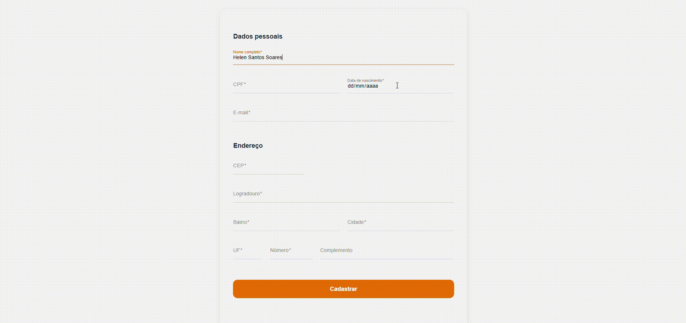

# 🎨 cadastro-pessoas-frontend

Interface web para cadastro de pessoas com geração automática de login, desenvolvida em Angular com identidade visual do Itaú Unibanco

> 📚 Documentação completa do projeto, requisitos funcionais, não funcionais e diagramas: [cadastro-pessoas-backend](https://github.com/helen-silv4/cadastro-pessoas-backend)



<br>

## 🚀 Stack
 
| Tecnologia | Versão |
|-----------|--------|
| Angular | 19+ |
| Angular Material | 21+ |
| TypeScript | 5+ |
| SCSS | — |
| Docker + Nginx | — |
| GitHub Actions | — |
 
<br>

## 📋 Pré-requisitos
 
- Node.js 20+
- npm
- Angular CLI (`npm install -g @angular/cli`)
- Docker e Docker Compose (para execução via container)

<br>

## ▶️ Como executar
 
### 🐳 Com Docker (recomendado)
 
Na raiz do projeto **backend**, suba todos os serviços com um único comando:
 
```bash
docker compose up --build
```
 
| Serviço    | URL                                         |
|------------|---------------------------------------------|
| 🌐 Frontend   | http://localhost:4200                       |
| ⚙️ API        | http://localhost:8080                       |
| 📖 Swagger UI | http://localhost:8080/swagger-ui/index.html |
 
### 💻 Sem Docker (local)
 
```bash
npm install
ng serve
```
 
Acesse em: **http://localhost:4200**
 
> ⚠️ O backend vai estar rodando em http://localhost:8080
 
<br>

## ✨ Funcionalidades
 
- Cadastro de pessoa com validação em tempo real
- Preenchimento automático de endereço via CEP (ViaCEP)
- Máscara automática de CPF e CEP
- Validação de CPF com algoritmo de dígitos verificadores
- Validação de data de nascimento (não futura, máximo 120 anos)
- Exibição do login gerado após cadastro bem-sucedido
- Mensagens de erro claras por campo
- Interface responsiva para desktop, tablet e mobile

<br>

## 🎨 Identidade visual
 
A interface segue as diretrizes visuais do Itaú Unibanco:
 
| Elemento | Valor |
|----------|-------|
| 🟠 Cor primária | `#EC7000` (laranja) |
| ⬛ Cor secundária | `#1F2D3D` (grafite) |
| 🔤 Tipografia | Inter, sem serifa, espaçamento generoso |
| 🏛️ Tom visual | Institucional e confiável |
 
<br>

## 🗂️ Estrutura do projeto
 
```
src/
├── app/
│   ├── models/
│   │   └── pessoa.model.ts         # interfaces de request/response
│   ├── pages/
│   │   └── cadastro/
│   │       ├── cadastro.ts         # componente principal
│   │       ├── cadastro.html       # template
│   │       ├── cadastro.scss       # estilos
│   │       └── cadastro.spec.ts    # testes unitários
│   ├── services/
│   │   ├── pessoa.ts               # service de cadastro e CEP
│   │   └── pessoa.spec.ts          # testes do service
│   ├── app.config.ts
│   ├── app.ts
│   └── app.html
└── styles.scss                     # estilos globais e tema Material
```
 
<br>

## 🧪 Testes
 
```bash
npm run test -- --watch=false
```
 
### Casos cobertos
 
**CadastroComponent**
- ✅ Criação do componente
- ✅ Formulário inicia inválido
- ✅ Validação de nome obrigatório
- ✅ Rejeição de nome com uma palavra
- ✅ Rejeição de nome com caracteres especiais
- ✅ Aceitação de nome válido
- ✅ Validação de CPF obrigatório
- ✅ Rejeição de CPF inválido
- ✅ Aceitação de CPF válido
- ✅ Validação de e-mail obrigatório
- ✅ Rejeição de e-mail inválido
- ✅ Aceitação de e-mail válido
- ✅ Rejeição de data futura
- ✅ Rejeição de data anterior a 120 anos
- ✅ Aceitação de data válida
- ✅ Validação de CEP obrigatório
- ✅ Rejeição de CEP inválido
- ✅ Aceitação de CEP válido
- ✅ Formulário marcado como touched ao enviar inválido
- ✅ Reset do formulário ao chamar novoCadastro

**PessoaService**

- ✅ Criação do service
- ✅ POST para cadastrar pessoa
- ✅ GET para buscar CEP
- ✅ Retorno de erro quando CEP não encontrado